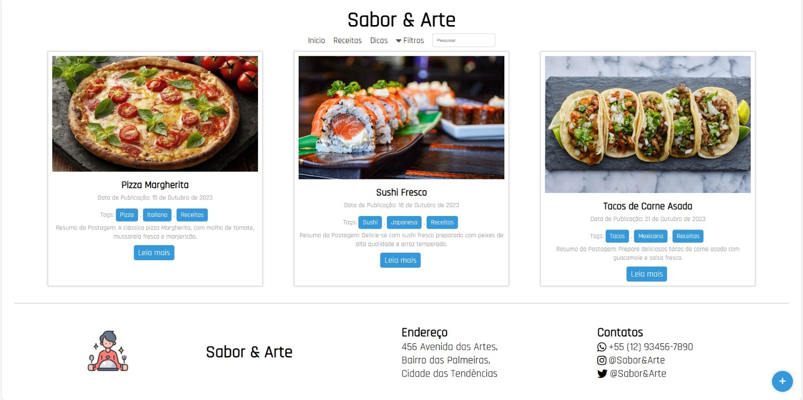
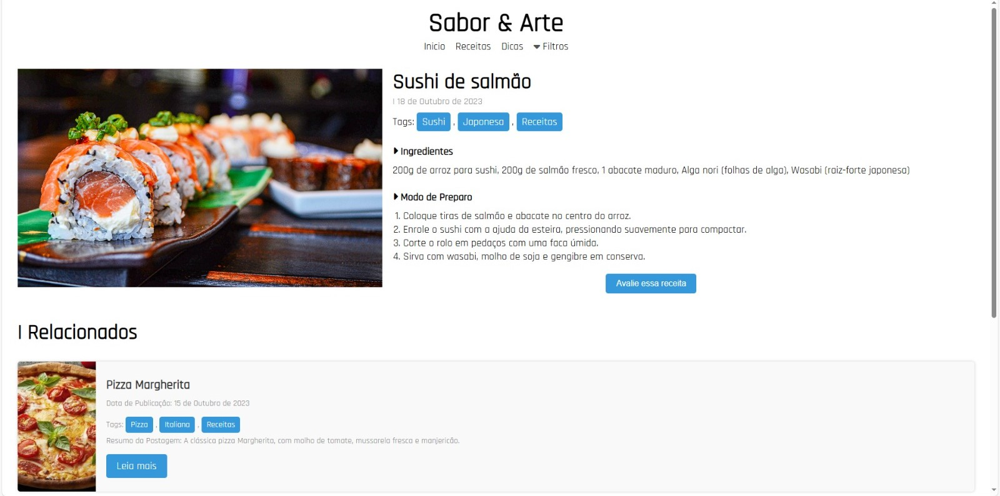

# 🍽️ **Sabor & Arte**

Este projeto é um site de culinária chamado **Sabor & Arte**, desenvolvido com HTML, CSS, e JavaScript. Ele oferece receitas, dicas e um sistema de adição de novas postagens, onde os usuários podem cadastrar e compartilhar receitas de maneira simples e prática.

## 📋 **Funcionalidades**

- **Menu de Navegação**: Inclui links para páginas de "Início", "Receitas" e "Dicas", além de filtros para pesquisa de receitas.
- **Formulário para Adicionar Receitas**: Permite que os usuários adicionem novas postagens de receitas com título, data, tags e imagens.
- **Cards de Receitas**: Exibição de cards com receitas, incluindo título, resumo, imagem e links para detalhes.
- **Avaliação de Receitas**: Opção de avaliação das receitas por parte dos usuários.
- **Design Responsivo**: A interface é adaptada para dispositivos móveis, com suporte para várias telas e tamanhos de dispositivos.

## 🚀 **Como Utilizar**

1. **Navegar no Site**:
   - Acesse as seções "Início" e "Receitas" através do menu superior.
   - Use a barra de pesquisa para encontrar receitas específicas.

2. **Adicionar Receita**:
   - Clique no botão "+" para abrir o formulário de criação de uma nova receita.
   - Preencha os campos obrigatórios, como título, data de publicação, tags, resumo e imagem.
   - Clique em "Adicionar Card" para publicar sua receita.

3. **Ver Detalhes da Receita**:
   - Clique em uma receita no card para acessar a página detalhada, onde os ingredientes e modo de preparo são exibidos.
   - Avalie a receita clicando no botão "Avalie essa receita".

4. **Filtrar Receitas**:
   - Utilize a opção de "Filtros" para buscar receitas específicas por tags.

## 🛠️ **Tecnologias Utilizadas**

- **HTML**: Estrutura básica do site.
- **CSS**: Estilização do layout e design responsivo.
- **JavaScript/jQuery**: Lógica do formulário de adição de receitas e interação com os cards.
- **Font Awesome**: Ícones para a interface (como filtros, avaliação e redes sociais).
- **Favicon**: Ícones personalizados para o navegador.
- **Imagens**: Diversas imagens de receitas para tornar o site visualmente atrativo.

## 🖼️ **Prévia**

| Página Inicial | Detalhes da Receita |
|-------------------------------|-------------------------------|
|  |  |

## 📦 **Como Executar o Projeto**

### 1. Clone o repositório:

```bash
git clone https://github.com/eduardomarcolin09/SaborEArte.git
```

### 2. Acesse a pasta do projeto:

```bash
cd SaborEArte
```

### 3. Abra o arquivo index.html em um navegador.

## 📝 **Melhorias Futuras**

- Adicionar uma funcionalidade de comentários para que os usuários possam interagir sobre as receitas.
- Incluir um sistema de categorias para organizar melhor as receitas (ex: sobremesas, pratos principais, etc.).
- Melhorar a área de avaliações, permitindo que os usuários escrevam comentários e deem notas para as receitas.
- Implementar um sistema de login para os usuários poderem salvar suas receitas favoritas.

## 📚 **Notas Finais**

- Este projeto foi desenvolvido como uma prática de criação de sites com HTML, CSS e JavaScript, focado na - - interação com o usuário e usabilidade.
- Caso encontre algum bug ou deseje sugerir melhorias, sinta-se à vontade para abrir uma issue no repositório.
- O Sabor & Arte é uma plataforma simples e prática para quem ama a culinária e deseja compartilhar receitas com o mundo!